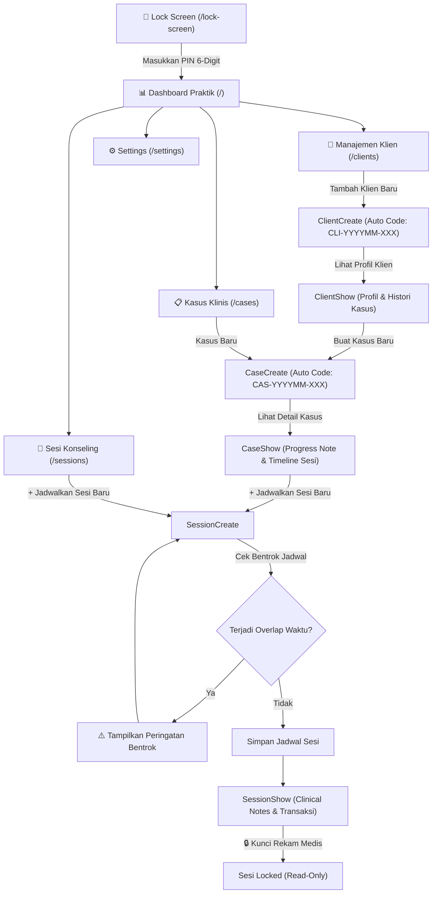

# 🧠 Web Psikolog — Internal Practice & Clinical Management System

[](https://laravel.com)
[](https://livewire.laravel.com)
[](https://tailwindcss.com)
[](https://sqlite.org)
[](https://php.new)
[](#-pengujian--kualitas-kode)

---

## 📖 Tentang Proyek

**Web Psikolog** adalah aplikasi web manajemen praktik psikologi internal dan rekam medis klinis berbasis **Laravel 13** dan **Livewire 4**. Aplikasi ini dirancang khusus untuk mempermudah praktisi psikolog dalam mengelola direktori klien, kasus medis, penjadwalan sesi konseling dengan **validasi anti-overlap waktu**, pengisian catatan klinis (*clinical notes*), hingga penguncian dokumen rekam medis yang terlindungi oleh **PIN Security Key 6-Digit**.

---

## 🛠️ Tech Stack & Arsitektur

| Komponen | Teknologi | Deskripsi |
| :--- | :--- | :--- |
| **Framework Backend** | Laravel 13.x (PHP 8.5) | Routing, Eloquent ORM, Middleware, Service Container |
| **Frontend Reactive** | Livewire 4.x | Komponen SPA reaktif tanpa perlu JavaScript API terpisah |
| **UI Styling** | Tailwind CSS 4.x | Responsive dark-mode UI design |
| **Database Engine** | SQLite | Database lokal ringan dengan UUID Primary Keys & Soft Deletes |
| **Keamanan** | Custom PIN Middleware | Encrypted Hash PIN 6-Digit & Session Guard |
| **Test Suite** | PHPUnit / Laravel Testing | 32 Test Suites (62 Assertions) Lulus 100% |

---

## 🚀 Fitur Utama

### 1. 🔑 Lock Screen & Proteksi Keamanan PIN 6-Digit (Modul 2 & 6)
- **Virtual Keypad Lock Screen (`/lock-screen`)**: Seluruh halaman aplikasi dilindungi oleh PIN 6-digit (Default PIN: `123456`).
- **Middleware Guard (`pin.protected`)**: Memastikan akses tanpa sesi `pin_unlocked` selalu di-redirect ke halaman Lock Screen.
- **Pengaturan PIN (`/settings/security`)**: Fitur ubah PIN dengan verifikasi PIN lama dan **Instant Lock Screen (`🔒`)** untuk mengunci aplikasi secara langsung.

### 2. 👥 Manajemen Data Klien / Pasien (Modul 3)
- **Auto-Generate Kode Klien**: Format unik otomatis `CLI-YYYYMM-XXX`.
- **Direktori & Pencarian Real-Time (`/clients`)**: Pencarian nama, kode klien, atau HP, filter jenis kelamin, paginasi, dan *Soft Delete*.
- **Pendaftaran Klien (`/clients/create`)**: Pencatatan identitas pribadi lengkap & kontak darurat (nama, hp, relasi).
- **Profil & Rekam Histori (`/clients/{id}`)**: Menampilkan detail profil, kontak darurat, serta daftar riwayat kasus & sesi konseling.

### 3. 📋 Manajemen Kasus Klinis / Rekam Medis (Modul 4)
- **Auto-Generate Kode Kasus**: Format unik otomatis `CAS-YYYYMM-XXX`.
- **Manajemen Program Terapi (`/cases`)**: Penautan kasus ke klien, pencatatan keluhan awal (*Initial Complaint*), dan target terapi (*Therapy Goal*).
- **Pengubahan Status Kasus**: Toggle status *Active*, *On Hold*, *Completed*, atau *Cancelled*.
- **Evaluasi Perkembangan Global (*Progress Note*)**: Catatan ringkasan perkembangan progres terapi klien secara berkesinambungan.

### 4. 📅 Penjadwalan Sesi Konseling & Catatan Klinis (Modul 5)
- **🛡️ Validasi Anti-Overlap Waktu**: Secara otomatis mendeteksi dan **mencegah bentrokan jadwal** jika ada sesi lain pada tanggal & rentang jam yang sama.
- **Pencatatan Clinical Notes (`/sessions/{id}`)**:
  - *Dynamic Summary* (Ringkasan sesi)
  - *Psychological Dynamics* (Dinamika emosi, kognisi, perilaku)
  - *Therapy Interventions* (Teknik terapi yang digunakan)
  - *Homework & Recommendations* (Tugas rumah & rekomendasi)
- **🔒 Penguncian Sesi (Lock Session)**: Mengunci dokumen rekam medis menjadi *read-only* demi mematuhi standar hukum rekam medis.
- **Manajemen Transaksi**: Pengelolaan tarif konseling, status pembayaran (*Unpaid, Paid, Waived*), dan metode pembayaran (*Cash, Transfer, QRIS*).

### 5. 🗂️ Master Reference Manager (Modul 6)
- Pengelolaan opsi *dropdown* dinamis untuk Kategori Kasus, Tipe Follow-Up, dan Metode Pembayaran via GUI (`/settings/references`) tanpa perlu *hardcode* di program.

### 6. 📊 Dashboard Praktik Psikologi (`/`)
- Kartu statistik real-time: Total Klien, Kasus Aktif, Sesi Hari Ini, dan Sesi Mendatang.
- Agenda konseling hari ini dengan akses cepat ke kelola sesi.
- Quick Actions untuk pendaftaran Klien Baru, Kasus Baru, dan Jadwal Sesi Baru.

---

## 🔄 Alur Kerja Sistem (System Workflow)



---

## ⚡ Panduan Instalasi & Jalankan Sistem

### Prerequisites
- PHP `>= 8.3` (Disarankan PHP 8.5)
- Composer `>= 2.x`

### Langkah-Langkah

1. **Clone Repository**:
   ```bash
   git clone <repository-url>
   cd web-psikolog
   ```

2. **Install Composer Dependencies**:
   ```bash
   composer install
   ```

3. **Setup Environment File**:
   ```bash
   cp .env.example .env
   php artisan key:generate
   ```

4. **Jalankan Database Migration & Seeding**:
   ```bash
   php artisan migrate:fresh --seed
   ```

5. **Jalankan Test Suite (Opsional)**:
   ```bash
   php artisan test
   ```

6. **Jalankan Local Web Server**:
   ```bash
   php artisan serve
   ```
   Akses aplikasi di browser pada `http://127.0.0.1:8000`.

---

## 🔑 Kredensial Awal

- **PIN Security Key Default**: `123456`
  *(Dapat diubah kapan saja via menu **Keamanan PIN** di `/settings/security`)*

---

## 🧪 Pengujian & Kualitas Kode

Seluruh fungsi aplikasi dilindungi oleh pengujian otomatis (*Automated Feature Testing*):

```bash
php artisan test
```

**Hasil Pengujian:**
- **32 Test Suites**
- **62 Assertions**
- **Status:** `100% PASSED`

---

## 📄 Lisensi

Proyek ini menggunakan lisensi [MIT License](LICENSE).
